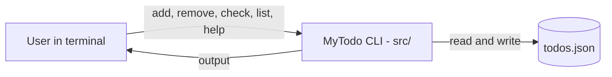

<div align="center">

# ✅ MyTodo

**A command line tool for managing your todo list, written in Rust.**

<p>
  
  
  
  
</p>

</div>

> 🦀 A small personal project made while learning Rust.

## 📑 Table of Contents

- [📖 About](#about)
- [🏗️ Architecture](#architecture)
- [✨ Features](#features)
- [🛠️ Tech Stack](#tech-stack)
- [🚀 Getting Started](#getting-started)
- [⌨️ Usage](#usage)
- [📄 License](#license)
- [👤 Author](#author)

## 📖 About

- MyTodo is a simple todo list that lives in your terminal.
- Items are added, removed, checked off and listed with short commands.
- Todos are persisted in a local `todos.json` file, so your list is still there the next time you run the tool.
- The project is built with Cargo and has its source code in `src/`.

## 🏗️ Architecture



## ✨ Features

- Add a new item to your list with `add`.
- Remove an item by its position with `remove`.
- Toggle an item between done and undone with `check`.
- Show all items with `list`.
- Built-in `help` command that explains the usage.
- Todos are stored as JSON in `todos.json`, with no server or database required.

## 🛠️ Tech Stack

| Area | Technologies |
| --- | --- |
| Language | Rust |
| Build tool | Cargo |
| Storage | JSON file (`todos.json`) |

## 🚀 Getting Started

### Prerequisites

- [Rust and Cargo](https://www.rust-lang.org/tools/install)

### Clone

```bash
git clone https://github.com/MriceDK/MyTodo.git
cd MyTodo
```

### Run

```bash
cargo run -- help
```

Everything after `--` is passed to MyTodo as its command and arguments.

### Build a release binary

```bash
cargo build --release
```

The compiled binary will be placed in `target/release/`.

## ⌨️ Usage

```text
todo <command> [args]
```

| Command | Description |
| --- | --- |
| `add <task>` | Adds a new item to the list. |
| `remove <id>` | Removes the item at position `<id>`. |
| `check <id>` | Toggles done/undone for the item at position `<id>`. |
| `list` | Shows all items in the list. |
| `help` | Shows the help message. |

### Examples

```bash
cargo run -- add "Write the README"
cargo run -- list
cargo run -- check 1
cargo run -- remove 1
```

If you use the compiled binary instead of `cargo run`, replace `cargo run --` with the path to the binary in `target/release/`.

<!-- TODO: confirm whether item positions (<id>) start at 0 or 1, and whether the binary is named `todo` or `MyTodo` in Cargo.toml. -->

## 📄 License

This project is licensed under the [MIT License](LICENSE).

## 👤 Author

| Name | GitHub | LinkedIn |
| --- | --- | --- |
| Maurice De Kegel | [MriceDK](https://github.com/MriceDK) | [LinkedIn](https://www.linkedin.com/in/dekegelmaurice/) |
